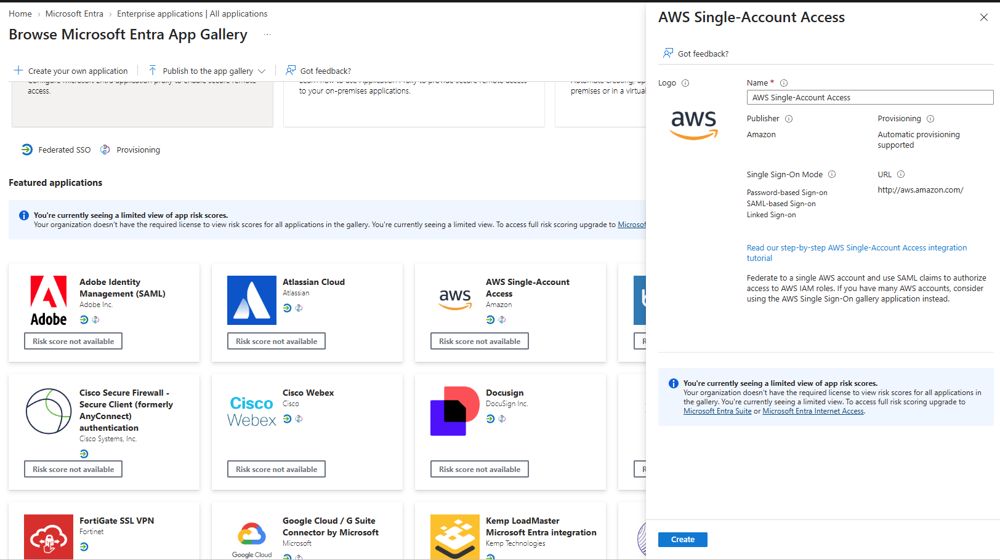
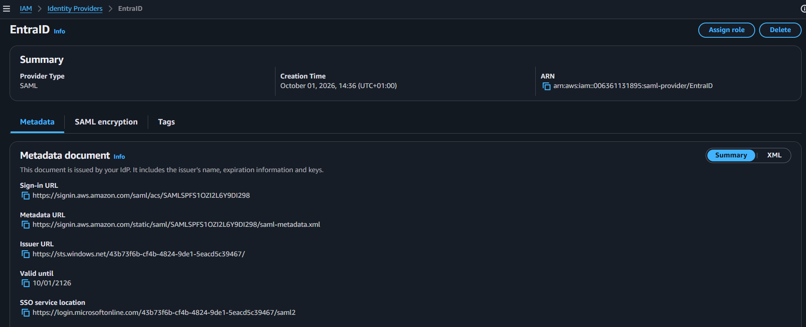
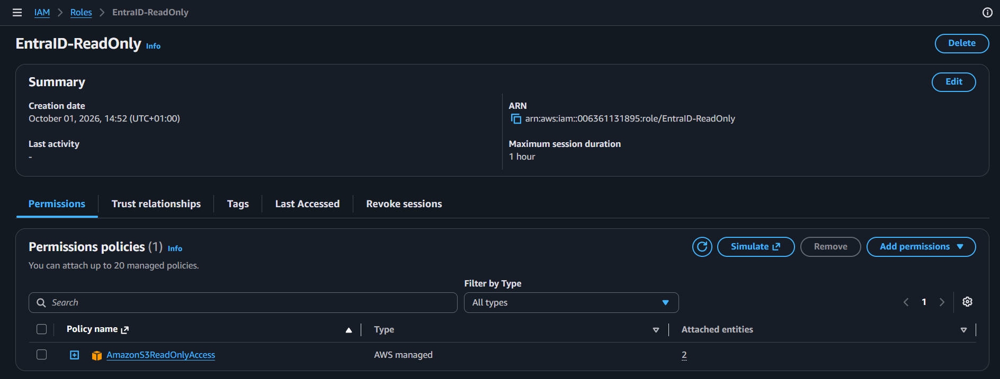
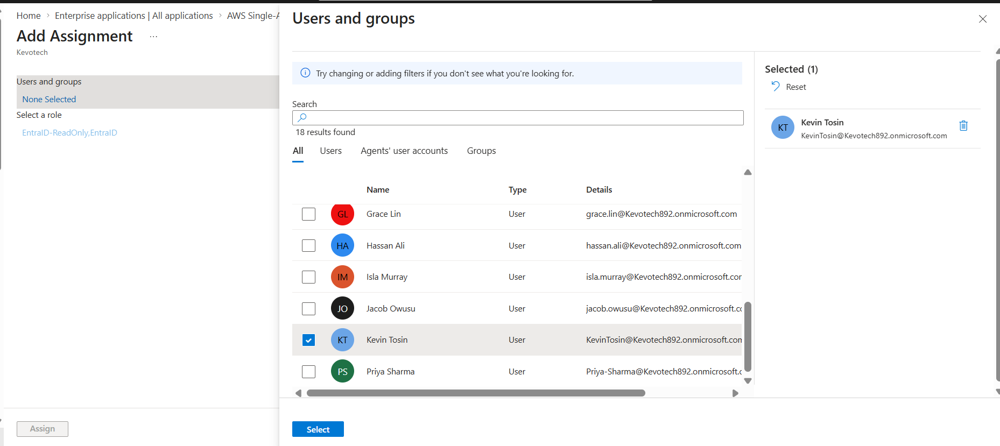
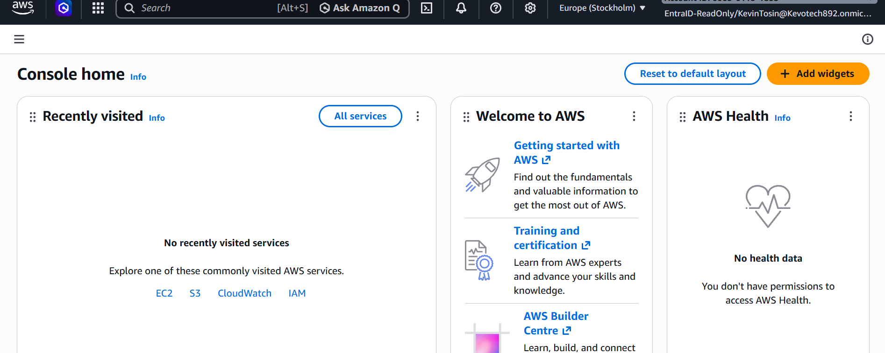

# Cross-Cloud Federation: Entra ID → AWS with SAML

**Platform:** Microsoft Entra ID (IdP) · AWS IAM (SP) · SAML 2.0
**Domain:** Identity & Access Management · Federation / Single Sign-On · Zero Trust
**Approach:** Eliminate standing AWS credentials — centralised identity, just-in-time federated role access, least privilege

---

## The problem — a real-world attack, not a hypothetical

In **June 2014, Code Spaces** a code-hosting and project-management company was **destroyed in a matter of hours**. An attacker gained access to the company's **AWS control panel**, left a ransom note, and when Code Spaces tried to wrestle back control, the attacker **deleted most of their data, backups, and machine configurations**. The company could not recover and **went out of business within days**. [1][2]

The entry point was the thing this project removes: **standing access to AWS that lived outside a governed identity.** Code Spaces' AWS console access wasn't protected by strong, centralised identity controls — so once that access was compromised, the attacker *was* the admin, with nothing standing in the way. The same pattern repeats everywhere: **long-lived AWS access keys** leaked in a public GitHub repo, a shared console password with no MFA, a standalone credential that outlives the person who needed it. Every one of them is a key to the cloud kingdom sitting outside the identity system where MFA, Conditional Access, and lifecycle controls actually live.

Federation fixes the root cause: there is **no separate AWS password or key to steal.** Access to AWS flows through the identity provider, where every sign-in is verified, MFA'd, risk-assessed, and governed — and what AWS grants is a **short-lived, assumed-role session**, not a standing credential.

## What this project is — and the skills it proves

This project builds **cross-cloud federation** between **Microsoft Entra ID** and **AWS** using **SAML 2.0**. A user signs into AWS using their Entra identity no AWS password, no access key and lands in a least-privilege IAM role. It demonstrates the identity-engineering skills to centralise authentication in one trusted provider, extend an organisation's identity controls across cloud boundaries, and replace standing credentials with just-in-time federated access.

| What killed Code Spaces (and leaks like it) | What federation changes |
|---|---|
| AWS access sat outside central identity control | Authentication is centralised in **Entra** — one governed identity plane |
| Standalone AWS credential could be stolen and reused | **No AWS password or key exists** to steal — Entra vouches via a signed assertion |
| Compromised credential = standing admin | AWS grants a **short-lived, assumed-role session**, scoped least-privilege |
| No MFA / conditional checks on that access | Every sign-in inherits Entra **MFA, Conditional Access, and risk policies** |

The rest of this document shows the build on both sides of the trust and a live federated login into AWS.

---

## The concept — IdP, SP, and the assertion

SAML federation is a trust between three things:

- **IdP (Identity Provider) = Entra.** It verifies *who you are* (password + MFA).
- **SP (Service Provider) = AWS.** The thing you're signing into.
- **The assertion.** A digitally **signed** statement Entra hands to AWS that says *"this is Kevin, I've verified him, and here is the role he may assume."* AWS checks the signature, trusts it, and issues a temporary session.

The login flow: you reach AWS → AWS redirects you to Entra → Entra authenticates you (MFA) → Entra issues the **signed assertion** → AWS trusts the signature and drops you into the mapped IAM role. SAML carries **both** halves of access: *who you are* (authentication) and *what you may do* (authorisation), in one signed token.

---

## Build & proof

### 1. Entra side — configure SAML (the IdP)

In Entra, the **AWS Single-Account Access** application is configured for SAML single sign-on: the AWS SAML endpoint as the identifier and reply URL, and the Role / RoleSessionName claims that carry the user's AWS role in the assertion.

### 2. AWS side — trust Entra (the Identity Provider)

In AWS IAM, an **Identity Provider** named `EntraID` is created by uploading Entra's federation metadata (its certificate and sign-in address). This is AWS saying *"I will trust assertions signed by this Entra tenant."*

### 3. AWS side — a least-privilege role for federated users

An IAM role, **`EntraID-ReadOnly`**, is created with a trust policy that allows the EntraID provider to assume it via SAML, and a **read-only** permissions policy. Federated users get the minimum access needed — not standing admin.

### 4. Linking the two sides — role assignment in Entra

Entra reads the AWS role automatically (via provisioning), and the user is assigned to it. The assigned value — **`EntraID-ReadOnly,EntraID`** — is the **role ARN + provider ARN** pair that AWS needs in the assertion to know which role to grant.

### 5. The proof — logged into AWS with no AWS password

Signing in through Entra (with MFA) lands directly in the **AWS Management Console**. The identity shown top-right — **`EntraID-ReadOnly/KevinTosin@...`** — is in `role/username` format, the signature of a **federated** session: authenticated by Entra, authorised into a short-lived AWS role, with no AWS credential involved.

This is the whole point made visible: cloud access without a standing cloud credential the thing whose absence destroyed Code Spaces.

---

## Key design decisions

- **No standing AWS credentials.** Access is a short-lived assumed-role session, issued only after Entra authenticates the user. There is no AWS password or access key to leak the root cause of the Code Spaces class of breach.
- **Least privilege by default.** The federated role is scoped read-only, not admin. A federated identity gets the minimum, and the role's permissions can be tightened or widened without touching the trust.
- **One identity plane.** Authentication is centralised in Entra, so AWS access automatically inherits MFA, Conditional Access, and Identity Protection — the controls built in the earlier projects now extend across the cloud boundary.
- **Provider-agnostic pattern.** The same SAML trust works with any IdP (Okta, Ping, etc.) only the console differs. The concept, not the buttons, is the transferable skill.
- **Separation of trust and permission.** The IdP trust (who AWS believes) and the IAM role policy (what they can do) are independent you can re-scope access without re-establishing trust.

---

## Future improvements

- **Group-based role mapping** map Entra groups to multiple AWS roles (e.g. ReadOnly, PowerUser, Admin) so access follows group membership, driven by the JML automation from Project 1.
- **Conditional Access on the AWS app** require compliant device or phishing-resistant MFA specifically for AWS federation (ties to Project 2).
- **PIM for the privileged AWS role** make an admin-level federated role eligible-only, activated just-in-time (ties to Project 3).
- **Access reviews on AWS access** periodically recertify who is federated into which AWS role (ties to Project 5).
- **Multi-account federation** extend from single-account to AWS Organizations / IAM Identity Center for enterprise scale.

---

## Skills demonstrated

· SAML 2.0 federation (IdP ↔ SP trust)
· Cross-cloud single sign-on (Entra → AWS)
· AWS IAM identity providers and federated roles
· Claim / attribute mapping and role assertion
· Least-privilege role design
· Eliminating standing cloud credentials
· Centralised identity governance across clouds
· Mapping controls to a real-world breach

---

## References

1. The Hacker News — [Cyber Attack On 'Code Spaces' Puts Hosting Service Out of Business](https://thehackernews.com/2014/06/cyber-attack-on-code-spaces-puts.html) (June 2014).
2. Infosecurity Magazine — [Code Spaces Demise Exposes Cloud Security Failings](https://www.infosecurity-magazine.com/news/code-spaces-demise-exposes-cloud/).
